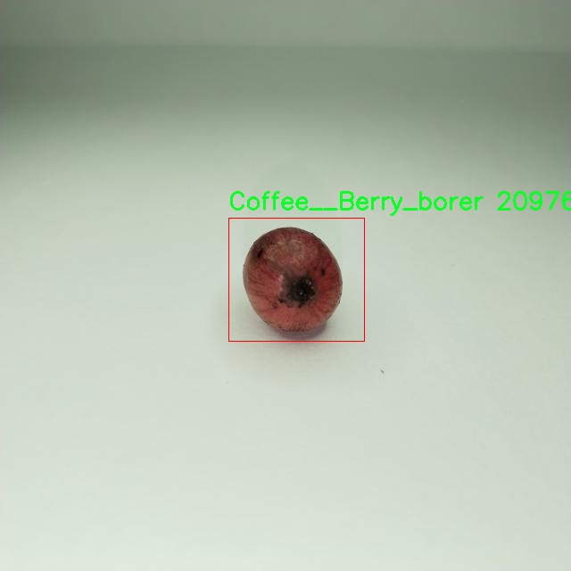

# 咖啡果实病虫害检测检测系统源码分享
 # [一条龙教学YOLOV8标注好的数据集一键训练_70+全套改进创新点发刊_Web前端展示]

### 1.研究背景与意义

项目参考[AAAI Association for the Advancement of Artificial Intelligence](https://gitee.com/qunshansj/projects)

项目来源[AACV Association for the Advancement of Computer Vision](https://gitee.com/qunmasj/projects)

研究背景与意义

随着全球咖啡消费的持续增长，咖啡产业在经济和社会发展中扮演着越来越重要的角色。然而，咖啡种植过程中面临的病虫害问题，尤其是咖啡果实的病虫害，严重影响了咖啡的产量和品质。根据统计，咖啡果实病虫害每年导致的经济损失高达数十亿美元，给农民和相关产业带来了巨大的压力。因此，开发高效、准确的病虫害检测系统，成为提升咖啡生产效率和质量的关键所在。

近年来，计算机视觉和深度学习技术的迅猛发展，为农业病虫害的检测提供了新的解决方案。YOLO（You Only Look Once）系列模型因其高效的实时检测能力，已广泛应用于物体检测领域。YOLOv8作为该系列的最新版本，具备更强的特征提取能力和更快的推理速度，能够在复杂环境中实现精准的目标识别。基于YOLOv8的咖啡果实病虫害检测系统，旨在利用其先进的深度学习算法，对咖啡果实的健康状况进行实时监测和分析。

本研究所使用的数据集包含2100张图像，涵盖了三类目标：咖啡果实虫害（Coffee_Berry_borer）、受损豆（Coffee_Damaged_bean）和健康豆（Coffee_Healthy_bean）。通过对这些图像的标注和训练，系统能够有效区分健康与受损的咖啡果实，及时识别出病虫害的发生。这不仅为农民提供了早期预警，减少了病虫害对咖啡生产的影响，也为后续的农业管理和决策提供了数据支持。

此外，基于改进YOLOv8的检测系统具有较高的灵活性和可扩展性。研究者可以根据不同的咖啡种植环境和病虫害类型，进一步优化模型参数和训练策略，以提高检测的准确性和鲁棒性。这种适应性使得该系统能够在不同地区和不同种植条件下推广应用，具有广泛的应用前景。

在全球气候变化和农业可持续发展的大背景下，病虫害的监测与管理显得尤为重要。通过引入智能化的检测系统，不仅可以提高咖啡生产的经济效益，还能促进农业的可持续发展，减少农药的使用，保护生态环境。因此，本研究的意义不仅体现在技术层面，更在于推动农业现代化和可持续发展，为咖啡产业的未来发展提供强有力的支持。

综上所述，基于改进YOLOv8的咖啡果实病虫害检测系统，具有重要的研究背景和现实意义。通过结合先进的深度学习技术与农业实际需求，旨在为咖啡产业提供一种高效、准确的病虫害检测解决方案，助力提升咖啡生产的质量和效率，推动农业的可持续发展。

### 2.图片演示


##### 注意：由于此博客编辑较早，上面“2.图片演示”和“3.视频演示”展示的系统图片或者视频可能为老版本，新版本在老版本的基础上升级如下：（实际效果以升级的新版本为准）

  （1）适配了YOLOV8的“目标检测”模型和“实例分割”模型，通过加载相应的权重（.pt）文件即可自适应加载模型。

  （2）支持“图片识别”、“视频识别”、“摄像头实时识别”三种识别模式。

  （3）支持“图片识别”、“视频识别”、“摄像头实时识别”三种识别结果保存导出，解决手动导出（容易卡顿出现爆内存）存在的问题，识别完自动保存结果并导出到tempDir中。

  （4）支持Web前端系统中的标题、背景图等自定义修改，后面提供修改教程。

  另外本项目提供训练的数据集和训练教程,暂不提供权重文件（best.pt）,需要您按照教程进行训练后实现图片演示和Web前端界面演示的效果。

### 3.视频演示

[3.1 视频演示](https://www.bilibili.com/video/BV1Ju4BevERa/)

### 4.数据集信息展示

##### 4.1 本项目数据集详细数据（类别数＆类别名）

nc: 3
names: ['Coffee__Berry_borer', 'Coffee__Damaged_bean', 'Coffee__Healthy_bean']


##### 4.2 本项目数据集信息介绍

数据集信息展示

在现代农业生产中，病虫害的监测与管理是确保作物健康生长的重要环节。为此，构建一个高效的病虫害检测系统显得尤为重要。本研究所使用的数据集名为“Berry Borer”，其主要目的是为改进YOLOv8模型在咖啡果实病虫害检测中的应用提供基础数据支持。该数据集专注于咖啡果实的健康状况，涵盖了三种主要类别，分别是“Coffee__Berry_borer”、“Coffee__Damaged_bean”和“Coffee__Healthy_bean”。

在“Berry Borer”数据集中，类别“Coffee__Berry_borer”代表了受到咖啡果实钻心虫（Berry Borer）侵害的咖啡果实。这种虫害是咖啡种植中最常见且危害最大的病虫害之一，能够导致果实的腐烂和产量的显著下降。因此，准确识别和及时处理这种虫害对于保障咖啡的产量和质量至关重要。数据集中包含了多种不同角度和光照条件下的受害果实图像，旨在提高模型的泛化能力，使其能够在实际应用中更有效地识别受损果实。

第二个类别“Coffee__Damaged_bean”则指的是已经受到损害的咖啡豆。这些豆子可能由于虫害、病菌感染或其他环境因素而变得不适合商业用途。该类别的图像数据同样丰富，涵盖了不同程度的损害情况，以便模型能够学习到各种损伤特征。这一类别的存在不仅有助于提升模型对损坏果实的识别能力，还能为后续的分类和处理提供重要依据。

最后，类别“Coffee__Healthy_bean”代表的是健康的咖啡豆。这一类别的数据在数据集中同样不可或缺，提供了一个对照组，使得模型能够有效区分健康与受损果实。健康的咖啡豆在外观上通常具有鲜亮的颜色和完整的形态，数据集中包含了大量的高质量图像，以确保模型能够准确学习到健康果实的特征。

总的来说，“Berry Borer”数据集的设计充分考虑了咖啡果实病虫害检测的实际需求，通过多样化的图像样本和明确的类别划分，为改进YOLOv8模型提供了坚实的基础。数据集的丰富性和多样性将极大地促进模型的训练效果，使其在实际应用中能够更快速、更准确地识别出病虫害，从而为咖啡种植者提供及时的预警和处理建议，最终实现提高咖啡产量和质量的目标。随着技术的不断进步，借助这一数据集所训练出的模型有望在未来的农业生产中发挥更大的作用，推动智能农业的发展。




### 5.全套项目环境部署视频教程（零基础手把手教学）

[5.1 环境部署教程链接（零基础手把手教学）](https://www.ixigua.com/7404473917358506534?logTag=c807d0cbc21c0ef59de5)


[5.2 安装Python虚拟环境创建和依赖库安装视频教程链接（零基础手把手教学）](https://www.ixigua.com/7404474678003106304?logTag=1f1041108cd1f708b01a)

### 6.手把手YOLOV8训练视频教程（零基础小白有手就能学会）

[6.1 手把手YOLOV8训练视频教程（零基础小白有手就能学会）](https://www.ixigua.com/7404477157818401292?logTag=d31a2dfd1983c9668658)

### 7.70+种全套YOLOV8创新点代码加载调参视频教程（一键加载写好的改进模型的配置文件）

[7.1 70+种全套YOLOV8创新点代码加载调参视频教程（一键加载写好的改进模型的配置文件）](https://www.ixigua.com/7404478314661806627?logTag=29066f8288e3f4eea3a4)

### 8.70+种全套YOLOV8创新点原理讲解（非科班也可以轻松写刊发刊，V10版本正在科研待更新）

由于篇幅限制，每个创新点的具体原理讲解就不一一展开，具体见下列网址中的创新点对应子项目的技术原理博客网址【Blog】：


[8.1 70+种全套YOLOV8创新点原理讲解链接](https://gitee.com/qunmasj/good)

### 9.系统功能展示（检测对象为举例，实际内容以本项目数据集为准）

图9.1.系统支持检测结果表格显示

  图9.2.系统支持置信度和IOU阈值手动调节

  图9.3.系统支持自定义加载权重文件best.pt(需要你通过步骤5中训练获得)

  图9.4.系统支持摄像头实时识别

  图9.5.系统支持图片识别

  图9.6.系统支持视频识别

  图9.7.系统支持识别结果文件自动保存

  图9.8.系统支持Excel导出检测结果数据


### 10.原始YOLOV8算法原理

原始YOLOv8算法原理

YOLOv8是Ultralytics于2023年1月发布的一款先进目标检测模型，标志着YOLO系列算法的又一次重要演进。作为一种单阶段检测算法，YOLOv8在继承了YOLO系列前作的基础上，融汇了YOLOX、YOLOv6、YOLOv7以及PPYOLOE等多种优秀设计理念，特别是在Head标签分配和Loss计算方面与PP-YOLOE相似，展现出强大的综合性能。YOLOv8的设计旨在实现高精度和快速检测，为目标检测领域带来了新的突破。

YOLOv8的网络结构由四个主要部分组成：输入层、Backbone骨干网络、Neck特征融合网络和Head检测模块。输入层负责对图像进行预处理，包括调整图像比例、实现Mosaic增强和瞄点计算等，以确保输入数据的多样性和丰富性，从而提高模型的泛化能力。Backbone部分采用了经过优化的DarkNet结构，特别是将C3模块替换为更轻量的C2f模块，这一变化不仅减少了计算复杂度，还提高了特征提取的效率。C2f模块的设计使得网络能够更好地捕捉不同尺度的特征信息，进而增强了模型对小目标的检测能力。

在特征提取过程中，YOLOv8引入了跨级结构（Cross Stage Partial, CSP）的思想，以促进梯度流动并减轻模型的过拟合风险。通过SPPF（Spatial Pyramid Pooling Fast）模块，YOLOv8对输出特征图进行处理，利用不同内核尺寸的池化操作合并特征图，进一步丰富了特征信息。这一过程为后续的特征融合打下了坚实的基础。

Neck部分采用了“双塔结构”，结合了特征金字塔网络（FPN）和路径聚合网络（PAN），以实现更高效的特征融合。特征金字塔网络通过不同层次的特征进行上下文信息的整合，而路径聚合网络则通过横向连接增强了语义信息与定位信息的传递。这种设计使得YOLOv8在处理不同尺度目标时表现出色，能够在复杂场景中保持高准确率。

在Head检测模块中，YOLOv8采用了解耦头的结构，将回归分支和预测分支分离。这一创新设计不仅加速了模型的收敛速度，还提高了检测精度。YOLOv8的检测模块包含三个Detect检测器，分别负责不同尺度目标的检测任务，通过这种多尺度的检测策略，YOLOv8能够有效应对各种目标的检测需求。

YOLOv8在损失函数的设计上也进行了重要改进，采用了新的损失策略。通过变焦损失计算分类损失，结合数据平均保真度损失和完美交并比损失（IoU Loss）来计算边界框损失。这种新的损失计算方式使得YOLOv8在目标检测中能够更加准确地定位目标，提高了检测的鲁棒性和精度。

在样本匹配方面，YOLOv8引入了新的匹配策略，优化了正负样本的选择过程，使得模型在训练过程中能够更有效地学习到目标的特征。这种改进使得YOLOv8在面对复杂背景和多目标场景时，依然能够保持高效的检测性能。

总的来说，YOLOv8通过一系列的结构优化和算法改进，实现了在检测精度和速度上的双重提升。其高效的特征提取、丰富的特征融合以及创新的损失计算策略，使得YOLOv8在目标检测领域达到了一个新的高度。尤其是在实时检测的应用场景中，YOLOv8展现出了强大的竞争力，能够满足工业界和学术界对高效、准确目标检测的需求。

在实际应用中，YOLOv8的优势尤为明显。例如，在苹果采摘的场景中，利用YOLOv8的视觉识别能力，可以自动检测和定位苹果，为自动采摘机器人提供精准的目标信息。通过结合蚁群算法进行路径规划，机器人能够快速、有效地完成苹果的采摘任务。这一应用不仅提高了采摘效率，还为农业自动化提供了新的解决方案。

综上所述，YOLOv8作为当前最优秀的目标检测算法之一，其原理和设计理念的创新为目标检测领域带来了新的机遇和挑战。随着YOLOv8的不断发展和应用，其在各个领域的潜力将会被进一步挖掘，推动目标检测技术的持续进步。


### 11.项目核心源码讲解（再也不用担心看不懂代码逻辑）

#### 11.1 70+种YOLOv8算法改进源码大全和调试加载训练教程（非必要）\ultralytics\nn\extra_modules\__init__.py

下面是对给定代码的逐文件分析和核心部分的保留，同时添加了详细的中文注释。

```python
# 导入不同模块中的所有内容
from .afpn import *  # 导入自适应特征金字塔网络（AFPN）相关的功能
from .attention import *  # 导入注意力机制相关的功能
from .block import *  # 导入基本网络块的定义
from .head import *  # 导入网络头部的定义，通常用于分类或回归任务
from .rep_block import *  # 导入重复块的定义，可能用于构建深层网络
from .kernel_warehouse import *  # 导入内核仓库，可能用于存储和管理卷积核
from .dynamic_snake_conv import *  # 导入动态蛇形卷积的实现
from .orepa import *  # 导入OREPA（可能是某种优化或增强的卷积方法）
from .RFAConv import *  # 导入RFA（可能是某种注意力卷积）相关的功能
```

### 核心部分分析

1. **模块导入**：
   - 这段代码主要是将不同模块中的功能导入到当前命名空间中。每个模块可能实现了特定的网络组件或算法，通常在深度学习框架中会有多个模块协同工作。

2. **功能概述**：
   - `afpn`：可能实现了自适应特征金字塔网络，增强了多尺度特征的提取能力。
   - `attention`：实现了注意力机制，帮助模型关注重要特征。
   - `block`：定义了网络中的基本构建块，可能是卷积层、激活层等。
   - `head`：网络的输出部分，通常用于分类或回归任务。
   - `rep_block`：实现了重复使用的网络块，可能用于深层网络的构建。
   - `kernel_warehouse`：管理卷积核的模块，可能用于动态选择或存储卷积核。
   - `dynamic_snake_conv`：实现了一种新的卷积方法，可能用于特定的图像处理任务。
   - `orepa`：可能是某种优化或增强的卷积方法，具体实现需要查看该模块。
   - `RFAConv`：实现了一种基于注意力机制的卷积，可能用于提升特征提取能力。

### 结论

上述代码主要用于导入多个深度学习相关的模块，每个模块都有其特定的功能。为了理解整个工程的核心功能，需要深入每个模块的实现细节。

这个文件是一个Python模块的初始化文件，通常命名为`__init__.py`，它的主要作用是将该目录标识为一个包，并可以在导入时执行一些初始化代码。在这个特定的文件中，代码的主要功能是从当前包中导入多个模块。

具体来说，这段代码从当前目录下的不同模块中导入了以下内容：

1. `afpn`：可能是实现了一种特征金字塔网络（FPN）的模块，用于增强模型对不同尺度特征的处理能力。
2. `attention`：通常与注意力机制相关，可能用于提升模型在特征选择上的能力。
3. `block`：可能定义了一些基本的网络结构块，这些块可以在构建更复杂的网络时复用。
4. `head`：通常指的是网络的输出部分，可能包含了分类或回归的逻辑。
5. `rep_block`：可能是实现了一种重复使用的网络块，常用于构建深层网络。
6. `kernel_warehouse`：可能涉及到卷积核的管理或生成，用于优化卷积操作。
7. `dynamic_snake_conv`：可能是实现了一种动态卷积操作的模块，可能用于提高卷积层的灵活性。
8. `orepa`：具体功能不明确，可能是某种特定的模块或算法。
9. `RFAConv`：可能是实现了一种特定的卷积操作，可能与注意力机制或特征增强相关。

通过这种方式，用户在导入这个包时，可以直接使用这些模块中的功能，而不需要单独导入每一个模块。这种设计提高了代码的可读性和模块化程度，使得整个项目的结构更加清晰。

#### 11.2 ui.py

```python
import sys
import subprocess

def run_script(script_path):
    """
    使用当前 Python 环境运行指定的脚本。

    Args:
        script_path (str): 要运行的脚本路径

    Returns:
        None
    """
    # 获取当前 Python 解释器的路径
    python_path = sys.executable

    # 构建运行命令
    command = f'"{python_path}" -m streamlit run "{script_path}"'

    # 执行命令
    result = subprocess.run(command, shell=True)
    if result.returncode != 0:
        print("脚本运行出错。")


# 实例化并运行应用
if __name__ == "__main__":
    # 指定您的脚本路径
    script_path = "web.py"  # 这里可以直接指定脚本名称，假设在当前目录下

    # 运行脚本
    run_script(script_path)
```

### 代码注释

1. **导入模块**：
   - `import sys`：导入系统相关的模块，用于获取当前 Python 解释器的路径。
   - `import subprocess`：导入子进程模块，用于在 Python 中执行外部命令。

2. **定义函数 `run_script`**：
   - 该函数接受一个参数 `script_path`，表示要运行的 Python 脚本的路径。

3. **获取当前 Python 解释器的路径**：
   - `python_path = sys.executable`：使用 `sys.executable` 获取当前 Python 解释器的完整路径。

4. **构建运行命令**：
   - `command = f'"{python_path}" -m streamlit run "{script_path}"'`：构建一个命令字符串，用于运行指定的脚本。这里使用了 `streamlit` 模块来运行 web 应用。

5. **执行命令**：
   - `result = subprocess.run(command, shell=True)`：使用 `subprocess.run` 执行构建的命令。`shell=True` 允许在 shell 中执行命令。

6. **检查命令执行结果**：
   - `if result.returncode != 0:`：检查命令的返回码，如果不为 0，表示脚本运行出错，打印错误信息。

7. **主程序入口**：
   - `if __name__ == "__main__":`：确保只有在直接运行该脚本时才会执行以下代码。
   - `script_path = "web.py"`：指定要运行的脚本路径。
   - `run_script(script_path)`：调用 `run_script` 函数，传入脚本路径以执行该脚本。

这个程序文件名为 `ui.py`，其主要功能是使用当前的 Python 环境来运行一个指定的脚本，具体是通过 Streamlit 框架来启动一个 Web 应用。

首先，程序导入了几个必要的模块，包括 `sys`、`os` 和 `subprocess`。其中，`sys` 模块用于访问与 Python 解释器相关的变量和函数，`os` 模块提供了与操作系统交互的功能，而 `subprocess` 模块则用于执行外部命令。

接下来，程序从 `QtFusion.path` 模块中导入了 `abs_path` 函数，这个函数的作用是获取给定路径的绝对路径。

在 `run_script` 函数中，程序接受一个参数 `script_path`，这个参数是要运行的脚本的路径。函数首先获取当前 Python 解释器的路径，接着构建一个命令字符串，该命令用于通过 Streamlit 运行指定的脚本。命令的格式是 `"{python_path}" -m streamlit run "{script_path}"`，其中 `{python_path}` 和 `{script_path}` 分别被当前 Python 解释器的路径和要运行的脚本路径替换。

然后，程序使用 `subprocess.run` 方法来执行这个命令。如果命令执行的返回码不为 0，表示脚本运行出错，程序会打印出相应的错误信息。

在文件的最后部分，程序通过 `if __name__ == "__main__":` 判断当前模块是否是主程序。如果是，它会指定要运行的脚本路径，这里是通过 `abs_path("web.py")` 获取 `web.py` 的绝对路径。最后，调用 `run_script` 函数来运行这个脚本。

总体来说，这个程序的核心功能是通过 Streamlit 启动一个 Web 应用，并且在运行过程中能够处理可能出现的错误。

#### 11.3 70+种YOLOv8算法改进源码大全和调试加载训练教程（非必要）\ultralytics\engine\predictor.py

以下是经过简化和注释的核心代码部分，主要集中在预测的核心逻辑和处理流程上：

```python
import platform
from pathlib import Path
import cv2
import numpy as np
import torch
from ultralytics.cfg import get_cfg, get_save_dir
from ultralytics.data import load_inference_source
from ultralytics.nn.autobackend import AutoBackend
from ultralytics.utils import LOGGER, select_device, smart_inference_mode

class BasePredictor:
    """
    BasePredictor类用于创建预测器的基础类。
    """

    def __init__(self, cfg=None, overrides=None):
        """
        初始化BasePredictor类。

        Args:
            cfg (str, optional): 配置文件路径。
            overrides (dict, optional): 配置覆盖。
        """
        self.args = get_cfg(cfg, overrides)  # 获取配置
        self.save_dir = get_save_dir(self.args)  # 获取保存目录
        self.model = None  # 模型初始化
        self.device = None  # 设备初始化
        self.results = None  # 结果初始化

    def preprocess(self, im):
        """
        预处理输入图像以便进行推理。

        Args:
            im (torch.Tensor | List(np.ndarray)): 输入图像。

        Returns:
            torch.Tensor: 处理后的图像。
        """
        im = torch.from_numpy(im).to(self.device)  # 转换为Tensor并移动到指定设备
        im = im.float() / 255.0  # 归一化到[0, 1]
        return im

    def inference(self, im):
        """使用指定模型对给定图像进行推理。"""
        return self.model(im)  # 运行模型进行推理

    def __call__(self, source=None, model=None):
        """对图像或流进行推理。"""
        self.setup_model(model)  # 设置模型
        self.setup_source(source)  # 设置数据源

        for batch in self.dataset:  # 遍历数据集
            im = self.preprocess(batch)  # 预处理图像
            preds = self.inference(im)  # 进行推理
            self.results = self.postprocess(preds)  # 后处理结果
            yield self.results  # 返回结果

    def setup_model(self, model):
        """初始化YOLO模型并设置为评估模式。"""
        self.model = AutoBackend(model)  # 加载模型
        self.device = select_device(self.args.device)  # 选择设备
        self.model.eval()  # 设置模型为评估模式

    def setup_source(self, source):
        """设置数据源和推理模式。"""
        self.dataset = load_inference_source(source)  # 加载数据源

    def postprocess(self, preds):
        """对推理结果进行后处理。"""
        return preds  # 这里可以添加后处理逻辑
```

### 代码注释说明：
1. **类和方法说明**：对每个类和方法进行了简要的描述，说明其功能和参数。
2. **初始化**：在`__init__`方法中，配置文件和保存目录的获取，以及模型和设备的初始化。
3. **预处理**：`preprocess`方法负责将输入图像转换为适合模型输入的格式，包括归一化。
4. **推理**：`inference`方法直接调用模型进行推理。
5. **调用**：`__call__`方法是预测的主要入口，设置模型和数据源后，遍历数据集进行推理。
6. **模型和数据源设置**：`setup_model`和`setup_source`方法分别用于初始化模型和加载数据源。
7. **后处理**：`postprocess`方法用于处理推理结果，可以根据需要扩展。 

这样处理后的代码更为简洁，并且每个部分的功能都得到了清晰的说明。

这个程序文件是一个用于YOLOv8目标检测模型的预测器类（`BasePredictor`），其主要功能是对图像、视频、流媒体等进行推理（预测）。文件中包含了丰富的注释和文档字符串，详细说明了每个方法的用途和参数。

首先，文件导入了一些必要的库，包括`cv2`（OpenCV）、`numpy`、`torch`等，以及一些来自`ultralytics`模块的工具和配置函数。文件的开头部分提供了如何使用YOLOv8进行预测的示例，包括支持的输入源（如摄像头、图片、视频、YouTube链接等）和模型格式（如PyTorch、ONNX、TensorRT等）。

`BasePredictor`类的构造函数初始化了一些基本属性，如配置参数、保存结果的目录、模型、数据集等。它还包含了预处理、推理、后处理等多个步骤的方法。

在`preprocess`方法中，输入图像会被转换为适合模型输入的格式，包括调整大小和数据类型的转换。`inference`方法则调用模型进行推理，并根据需要进行可视化。

`write_results`方法负责将推理结果写入文件或目录，包括保存边界框、置信度等信息。`postprocess`方法对预测结果进行后处理，返回最终的结果。

`__call__`方法使得该类的实例可以像函数一样被调用，进行推理操作。`stream_inference`方法则实现了实时推理功能，适用于摄像头或视频流的输入。

文件中还定义了一些辅助方法，如`setup_source`用于设置输入源，`setup_model`用于初始化YOLO模型，`show`用于显示图像，`save_preds`用于保存预测结果等。

整个类设计得相对灵活，支持多种输入源和输出格式，同时提供了丰富的回调机制，可以在不同的推理阶段执行自定义操作。通过这些功能，用户可以方便地进行目标检测任务，并根据需要进行结果的保存和展示。

#### 11.4 train.py

以下是经过简化和注释的核心代码部分，主要保留了训练检测模型的关键功能和流程：

```python
import random
import numpy as np
import torch.nn as nn
from ultralytics.data import build_dataloader, build_yolo_dataset
from ultralytics.engine.trainer import BaseTrainer
from ultralytics.models import yolo
from ultralytics.nn.tasks import DetectionModel
from ultralytics.utils import LOGGER, RANK
from ultralytics.utils.torch_utils import de_parallel, torch_distributed_zero_first

class DetectionTrainer(BaseTrainer):
    """
    扩展自 BaseTrainer 类，用于基于检测模型的训练。
    """

    def build_dataset(self, img_path, mode="train", batch=None):
        """
        构建 YOLO 数据集。

        参数:
            img_path (str): 包含图像的文件夹路径。
            mode (str): 模式为 `train` 或 `val`，用户可以为每种模式自定义不同的增强。
            batch (int, optional): 批次大小，适用于 `rect` 模式。默认为 None。
        """
        gs = max(int(de_parallel(self.model).stride.max() if self.model else 0), 32)
        return build_yolo_dataset(self.args, img_path, batch, self.data, mode=mode, rect=mode == "val", stride=gs)

    def get_dataloader(self, dataset_path, batch_size=16, rank=0, mode="train"):
        """构造并返回数据加载器。"""
        assert mode in ["train", "val"]
        with torch_distributed_zero_first(rank):  # 仅在 DDP 时初始化数据集 *.cache 一次
            dataset = self.build_dataset(dataset_path, mode, batch_size)
        shuffle = mode == "train"  # 训练模式下打乱数据
        workers = self.args.workers if mode == "train" else self.args.workers * 2
        return build_dataloader(dataset, batch_size, workers, shuffle, rank)  # 返回数据加载器

    def preprocess_batch(self, batch):
        """对图像批次进行预处理，包括缩放和转换为浮点数。"""
        batch["img"] = batch["img"].to(self.device, non_blocking=True).float() / 255  # 将图像归一化到 [0, 1]
        if self.args.multi_scale:  # 如果启用多尺度训练
            imgs = batch["img"]
            sz = (
                random.randrange(self.args.imgsz * 0.5, self.args.imgsz * 1.5 + self.stride)
                // self.stride
                * self.stride
            )  # 随机选择图像大小
            sf = sz / max(imgs.shape[2:])  # 计算缩放因子
            if sf != 1:
                ns = [
                    math.ceil(x * sf / self.stride) * self.stride for x in imgs.shape[2:]
                ]  # 计算新的形状
                imgs = nn.functional.interpolate(imgs, size=ns, mode="bilinear", align_corners=False)  # 调整图像大小
            batch["img"] = imgs
        return batch

    def get_model(self, cfg=None, weights=None, verbose=True):
        """返回 YOLO 检测模型。"""
        model = DetectionModel(cfg, nc=self.data["nc"], verbose=verbose and RANK == -1)  # 创建检测模型
        if weights:
            model.load(weights)  # 加载权重
        return model

    def plot_training_samples(self, batch, ni):
        """绘制带有注释的训练样本。"""
        plot_images(
            images=batch["img"],
            batch_idx=batch["batch_idx"],
            cls=batch["cls"].squeeze(-1),
            bboxes=batch["bboxes"],
            paths=batch["im_file"],
            fname=self.save_dir / f"train_batch{ni}.jpg",
            on_plot=self.on_plot,
        )

    def plot_metrics(self):
        """从 CSV 文件中绘制指标。"""
        plot_results(file=self.csv, on_plot=self.on_plot)  # 保存结果图像
```

### 代码注释说明：
1. **构建数据集**：`build_dataset` 方法用于根据给定的图像路径和模式（训练或验证）构建 YOLO 数据集，支持不同的增强策略。
2. **获取数据加载器**：`get_dataloader` 方法用于构造数据加载器，确保在分布式训练时只初始化一次数据集。
3. **预处理批次**：`preprocess_batch` 方法对输入的图像批次进行归一化和可能的多尺度调整，以提高模型的泛化能力。
4. **获取模型**：`get_model` 方法用于创建并返回一个 YOLO 检测模型，并可选择性地加载预训练权重。
5. **绘制训练样本和指标**：`plot_training_samples` 和 `plot_metrics` 方法用于可视化训练过程中的样本和性能指标，便于分析和调试。

这个程序文件 `train.py` 是一个用于训练 YOLO（You Only Look Once）目标检测模型的实现，基于 Ultralytics 提供的框架。文件中定义了一个名为 `DetectionTrainer` 的类，继承自 `BaseTrainer`，并实现了一系列与数据集构建、数据加载、模型训练和结果可视化相关的方法。

在 `DetectionTrainer` 类中，首先定义了一个 `build_dataset` 方法，用于构建 YOLO 数据集。该方法接收图像路径、模式（训练或验证）和批量大小作为参数，并根据模型的步幅计算合适的尺寸，以便于数据集的构建。

接着，`get_dataloader` 方法用于创建并返回数据加载器。它会根据模式（训练或验证）来初始化数据集，并设置是否打乱数据的顺序。对于训练模式，数据会被打乱，而在验证模式下则不会。

`preprocess_batch` 方法负责对输入的图像批次进行预处理，包括将图像缩放到适当的大小并转换为浮点数格式。该方法还支持多尺度训练，即在每个训练周期随机选择图像的尺寸。

`set_model_attributes` 方法用于设置模型的属性，包括类别数量和类别名称等。它确保模型能够正确处理数据集中的类别信息。

`get_model` 方法用于返回一个 YOLO 检测模型的实例，并可以选择加载预训练权重。

`get_validator` 方法返回一个用于验证模型性能的 `DetectionValidator` 实例，以便在训练过程中评估模型的效果。

`label_loss_items` 方法用于返回带有标签的训练损失项字典，这在目标检测和分割任务中是必要的。

`progress_string` 方法生成一个格式化的字符串，用于显示训练进度，包括当前的训练轮次、GPU 内存使用情况、损失值、实例数量和图像大小等信息。

`plot_training_samples` 方法用于绘制训练样本及其注释，以便于可视化训练过程中的样本。

最后，`plot_metrics` 和 `plot_training_labels` 方法用于绘制训练过程中的指标和标签，帮助用户更好地理解模型的训练效果和数据分布。

整体而言，这个文件提供了一个完整的训练流程，涵盖了数据准备、模型训练、损失计算和结果可视化等多个方面，适合用于 YOLO 模型的训练任务。

#### 11.5 code\ultralytics\nn\modules\conv.py

以下是经过简化并注释的核心代码部分，主要包括卷积相关的类和函数。

```python
import math
import torch
import torch.nn as nn

def autopad(k, p=None, d=1):
    """自动计算填充以保持输出形状与输入相同。"""
    if d > 1:
        k = d * (k - 1) + 1 if isinstance(k, int) else [d * (x - 1) + 1 for x in k]  # 计算实际的卷积核大小
    if p is None:
        p = k // 2 if isinstance(k, int) else [x // 2 for x in k]  # 如果未指定填充，则自动计算
    return p

class Conv(nn.Module):
    """标准卷积层，包含卷积、批归一化和激活函数。"""

    default_act = nn.SiLU()  # 默认激活函数

    def __init__(self, c1, c2, k=1, s=1, p=None, g=1, d=1, act=True):
        """初始化卷积层，参数包括输入通道数、输出通道数、卷积核大小、步幅、填充、分组、扩张和激活函数。"""
        super().__init__()
        self.conv = nn.Conv2d(c1, c2, k, s, autopad(k, p, d), groups=g, dilation=d, bias=False)  # 卷积层
        self.bn = nn.BatchNorm2d(c2)  # 批归一化层
        self.act = self.default_act if act is True else act if isinstance(act, nn.Module) else nn.Identity()  # 激活函数

    def forward(self, x):
        """前向传播：应用卷积、批归一化和激活函数。"""
        return self.act(self.bn(self.conv(x)))

class DWConv(Conv):
    """深度可分离卷积层，使用分组卷积。"""

    def __init__(self, c1, c2, k=1, s=1, d=1, act=True):
        """初始化深度卷积层，参数包括输入通道数、输出通道数、卷积核大小、步幅、扩张和激活函数。"""
        super().__init__(c1, c2, k, s, g=math.gcd(c1, c2), d=d, act=act)  # 使用最大公约数作为分组数

class ConvTranspose(nn.Module):
    """转置卷积层，通常用于上采样。"""

    default_act = nn.SiLU()  # 默认激活函数

    def __init__(self, c1, c2, k=2, s=2, p=0, bn=True, act=True):
        """初始化转置卷积层，参数包括输入通道数、输出通道数、卷积核大小、步幅、填充、是否使用批归一化和激活函数。"""
        super().__init__()
        self.conv_transpose = nn.ConvTranspose2d(c1, c2, k, s, p, bias=not bn)  # 转置卷积层
        self.bn = nn.BatchNorm2d(c2) if bn else nn.Identity()  # 批归一化层
        self.act = self.default_act if act is True else act if isinstance(act, nn.Module) else nn.Identity()  # 激活函数

    def forward(self, x):
        """前向传播：应用转置卷积、批归一化和激活函数。"""
        return self.act(self.bn(self.conv_transpose(x)))

class ChannelAttention(nn.Module):
    """通道注意力模块，用于增强特征通道的重要性。"""

    def __init__(self, channels: int) -> None:
        """初始化通道注意力模块，参数为通道数。"""
        super().__init__()
        self.pool = nn.AdaptiveAvgPool2d(1)  # 自适应平均池化
        self.fc = nn.Conv2d(channels, channels, 1, 1, 0, bias=True)  # 1x1卷积
        self.act = nn.Sigmoid()  # 激活函数

    def forward(self, x: torch.Tensor) -> torch.Tensor:
        """前向传播：计算通道注意力并应用于输入。"""
        return x * self.act(self.fc(self.pool(x)))  # 通过池化和卷积计算注意力权重并应用

class SpatialAttention(nn.Module):
    """空间注意力模块，用于增强特征图的空间信息。"""

    def __init__(self, kernel_size=7):
        """初始化空间注意力模块，参数为卷积核大小。"""
        super().__init__()
        assert kernel_size in (3, 7), "kernel size must be 3 or 7"  # 限制卷积核大小
        padding = 3 if kernel_size == 7 else 1
        self.cv1 = nn.Conv2d(2, 1, kernel_size, padding=padding, bias=False)  # 卷积层
        self.act = nn.Sigmoid()  # 激活函数

    def forward(self, x):
        """前向传播：计算空间注意力并应用于输入。"""
        return x * self.act(self.cv1(torch.cat([torch.mean(x, 1, keepdim=True), torch.max(x, 1, keepdim=True)[0]], 1)))  # 计算空间注意力

class CBAM(nn.Module):
    """卷积块注意力模块，结合通道和空间注意力。"""

    def __init__(self, c1, kernel_size=7):
        """初始化CBAM模块，参数为输入通道数和卷积核大小。"""
        super().__init__()
        self.channel_attention = ChannelAttention(c1)  # 通道注意力
        self.spatial_attention = SpatialAttention(kernel_size)  # 空间注意力

    def forward(self, x):
        """前向传播：依次应用通道注意力和空间注意力。"""
        return self.spatial_attention(self.channel_attention(x))  # 先应用通道注意力，再应用空间注意力
```

以上代码保留了卷积、深度卷积、转置卷积以及注意力模块的核心实现，并添加了详细的中文注释以帮助理解每个部分的功能和作用。

这个程序文件是一个用于实现卷积模块的Python代码，主要用于Ultralytics YOLO（You Only Look Once）目标检测模型。代码中定义了多个卷积相关的类和函数，以下是对代码的详细说明。

首先，文件导入了必要的库，包括数学库、NumPy和PyTorch。接着，定义了一个名为`autopad`的函数，用于根据给定的卷积核大小、填充和扩张参数自动计算填充量，以确保输出形状与输入形状相同。

接下来，定义了多个卷积类。`Conv`类实现了标准的卷积操作，包含卷积层、批归一化层和激活函数。构造函数接受多个参数，如输入通道数、输出通道数、卷积核大小、步幅、填充、分组和扩张。`forward`方法实现了前向传播，依次通过卷积、批归一化和激活函数处理输入。

`Conv2`类是对`Conv`类的简化版本，增加了一个1x1的卷积层，并在前向传播中将两个卷积的输出相加。它还提供了一个`fuse_convs`方法，用于融合并优化卷积操作。

`LightConv`类实现了一种轻量级卷积，使用了两个卷积层，其中一个是深度卷积（`DWConv`），用于减少计算量。

`DWConv`类实现了深度卷积，`DWConvTranspose2d`类实现了深度转置卷积，二者都通过分组卷积来减少参数量和计算量。

`ConvTranspose`类实现了转置卷积层，支持批归一化和激活函数。`Focus`类则用于将输入的空间信息聚合到通道维度上，适用于YOLO模型的特征提取。

`GhostConv`类实现了Ghost卷积，使用了两个卷积层，通过跳跃连接将特征图的输出拼接在一起。

`RepConv`类实现了一种重复卷积结构，支持训练和推理模式，提供了融合卷积层的功能，以提高推理速度。

接下来是注意力机制模块，包括`ChannelAttention`和`SpatialAttention`类，分别实现了通道注意力和空间注意力，用于增强特征图的表示能力。`CBAM`类则结合了这两种注意力机制，形成了一个完整的卷积块注意力模块。

最后，`Concat`类用于在指定维度上拼接多个张量，便于在网络中处理多路输入。

整体来看，这个文件实现了多种卷积操作和注意力机制，旨在提高YOLO模型的性能和效率，适用于目标检测任务。

#### 11.6 70+种YOLOv8算法改进源码大全和调试加载训练教程（非必要）\ultralytics\models\yolo\classify\train.py

以下是代码中最核心的部分，并附上详细的中文注释：

```python
import torch
from ultralytics.data import ClassificationDataset, build_dataloader
from ultralytics.engine.trainer import BaseTrainer
from ultralytics.models import yolo
from ultralytics.nn.tasks import ClassificationModel, attempt_load_one_weight
from ultralytics.utils import DEFAULT_CFG, LOGGER, RANK
from ultralytics.utils.torch_utils import is_parallel, strip_optimizer, torch_distributed_zero_first

class ClassificationTrainer(BaseTrainer):
    """
    扩展自 BaseTrainer 类的分类模型训练类。
    """

    def __init__(self, cfg=DEFAULT_CFG, overrides=None, _callbacks=None):
        """初始化 ClassificationTrainer 对象，支持配置覆盖和回调函数。"""
        if overrides is None:
            overrides = {}
        overrides['task'] = 'classify'  # 设置任务类型为分类
        if overrides.get('imgsz') is None:
            overrides['imgsz'] = 224  # 默认图像大小为224
        super().__init__(cfg, overrides, _callbacks)

    def set_model_attributes(self):
        """从加载的数据集中设置 YOLO 模型的类名。"""
        self.model.names = self.data['names']

    def get_model(self, cfg=None, weights=None, verbose=True):
        """返回配置好的 PyTorch 模型以进行 YOLO 训练。"""
        model = ClassificationModel(cfg, nc=self.data['nc'], verbose=verbose and RANK == -1)
        if weights:
            model.load(weights)  # 加载权重

        for m in model.modules():
            if not self.args.pretrained and hasattr(m, 'reset_parameters'):
                m.reset_parameters()  # 重置参数
            if isinstance(m, torch.nn.Dropout) and self.args.dropout:
                m.p = self.args.dropout  # 设置 dropout
        for p in model.parameters():
            p.requires_grad = True  # 设置为可训练
        return model

    def build_dataset(self, img_path, mode='train', batch=None):
        """根据图像路径和模式（训练/测试等）创建 ClassificationDataset 实例。"""
        return ClassificationDataset(root=img_path, args=self.args, augment=mode == 'train', prefix=mode)

    def get_dataloader(self, dataset_path, batch_size=16, rank=0, mode='train'):
        """返回 PyTorch DataLoader，预处理图像以进行推理。"""
        with torch_distributed_zero_first(rank):  # 在分布式训练中，确保数据集只初始化一次
            dataset = self.build_dataset(dataset_path, mode)

        loader = build_dataloader(dataset, batch_size, self.args.workers, rank=rank)
        # 附加推理变换
        if mode != 'train':
            if is_parallel(self.model):
                self.model.module.transforms = loader.dataset.torch_transforms
            else:
                self.model.transforms = loader.dataset.torch_transforms
        return loader

    def preprocess_batch(self, batch):
        """预处理一批图像和类标签。"""
        batch['img'] = batch['img'].to(self.device)  # 将图像移动到设备上
        batch['cls'] = batch['cls'].to(self.device)  # 将类标签移动到设备上
        return batch

    def get_validator(self):
        """返回 ClassificationValidator 实例以进行验证。"""
        self.loss_names = ['loss']  # 定义损失名称
        return yolo.classify.ClassificationValidator(self.test_loader, self.save_dir)

    def final_eval(self):
        """评估训练后的模型并保存验证结果。"""
        for f in self.last, self.best:
            if f.exists():
                strip_optimizer(f)  # 去除优化器信息
                if f is self.best:
                    LOGGER.info(f'\nValidating {f}...')
                    self.metrics = self.validator(model=f)  # 进行验证
                    self.metrics.pop('fitness', None)  # 移除不需要的指标
        LOGGER.info(f"Results saved to {self.save_dir}")  # 输出结果保存路径
```

### 代码核心部分说明：
1. **导入必要的库**：引入 PyTorch 和 Ultralytics 相关模块。
2. **ClassificationTrainer 类**：该类用于训练分类模型，继承自 `BaseTrainer`。
3. **初始化方法**：设置任务类型、图像大小等配置。
4. **模型属性设置**：从数据集中提取类名并设置到模型中。
5. **模型获取**：根据配置和权重加载模型，并设置为可训练状态。
6. **数据集构建**：根据给定路径和模式创建数据集实例。
7. **数据加载器获取**：返回数据加载器，并附加必要的图像预处理。
8. **批处理预处理**：将图像和类标签移动到指定设备（如 GPU）。
9. **验证器获取**：返回用于验证的分类验证器实例。
10. **最终评估**：评估训练后的模型并保存结果。

这些核心部分构成了分类模型训练的基础逻辑，确保模型能够正确加载、训练和评估。

该程序文件是用于训练YOLOv8分类模型的代码，主要定义了一个名为`ClassificationTrainer`的类，该类继承自`BaseTrainer`。该类提供了一系列方法来设置模型、构建数据集、处理批次数据、监控训练进度以及评估模型等功能。

在初始化方法中，`ClassificationTrainer`接受配置参数和可选的覆盖参数。如果没有提供图像大小，默认设置为224。这个类的核心功能是训练分类模型，因此在初始化时会将任务类型设置为“classify”。

`set_model_attributes`方法用于从加载的数据集中设置YOLO模型的类名。`get_model`方法则负责返回一个经过修改的PyTorch模型，配置为适合YOLO训练。如果提供了权重文件，它会加载这些权重，并为模型的每个模块设置参数。

`setup_model`方法用于加载、创建或下载模型。它会检查模型的类型，如果是本地文件或特定格式（如yaml），则会相应地加载模型。如果模型在Torchvision的预定义模型中，它会从中加载。

`build_dataset`方法创建一个`ClassificationDataset`实例，用于处理图像路径和模式（如训练或测试）。`get_dataloader`方法则返回一个PyTorch的DataLoader，用于对图像进行预处理，并将其转换为适合模型输入的格式。

`preprocess_batch`方法对批次数据进行预处理，将图像和类标签移动到指定的设备上。`progress_string`方法返回一个格式化的字符串，用于显示训练进度。

`get_validator`方法返回一个`ClassificationValidator`实例，用于验证模型的性能。`label_loss_items`方法用于返回带标签的训练损失项字典，尽管对于分类任务并不必要，但在其他任务中可能会用到。

`plot_metrics`方法用于从CSV文件中绘制训练指标。`final_eval`方法在训练结束后评估模型并保存验证结果，确保优化器被剥离以减小模型文件的大小。

最后，`plot_training_samples`方法用于绘制训练样本及其注释，以便于可视化训练过程中的样本数据。这些功能结合在一起，使得该类能够有效地进行YOLOv8分类模型的训练和评估。

### 12.系统整体结构（节选）

### 整体功能和构架概括

该项目是一个基于YOLOv8的目标检测和分类模型的实现，包含了多个模块和功能，以支持模型的训练、推理和评估。项目的整体架构包括以下几个主要部分：

1. **模型构建与训练**：提供了训练YOLOv8目标检测和分类模型的功能，支持自定义数据集的加载和预处理。
2. **推理与预测**：实现了对图像、视频和流媒体的实时推理，能够输出检测结果和分类结果。
3. **卷积模块**：实现了多种卷积操作和注意力机制，以增强模型的特征提取能力。
4. **工具与实用函数**：提供了一系列实用工具函数，用于模型的加载、损失计算、参数调整等。
5. **用户界面**：通过Streamlit等框架提供简单的用户界面，方便用户进行模型的使用和可视化。

以下是各个文件的功能整理表格：

| 文件路径                                                                                       | 功能描述                                                                                     |
|----------------------------------------------------------------------------------------------|--------------------------------------------------------------------------------------------|
| `ultralytics/nn/extra_modules/__init__.py`                                                  | 初始化模块，导入多个额外的神经网络模块，如注意力机制、特征金字塔等。                      |
| `ui.py`                                                                                      | 启动Streamlit Web应用，用于运行YOLOv8模型的推理和可视化。                                 |
| `ultralytics/engine/predictor.py`                                                           | 实现YOLOv8目标检测模型的推理功能，支持多种输入源和实时推理。                             |
| `train.py`                                                                                   | 训练YOLOv8分类模型的实现，包含数据集构建、模型训练和结果可视化等功能。                   |
| `ultralytics/nn/modules/conv.py`                                                            | 实现多种卷积操作和注意力机制，增强模型的特征提取能力。                                   |
| `ultralytics/models/yolo/classify/train.py`                                                 | 训练YOLOv8分类模型的实现，支持数据集加载、模型训练和评估。                               |
| `ultralytics/models/utils/__init__.py`                                                      | 初始化模型工具模块，可能包含一些模型相关的实用函数。                                     |
| `ultralytics/utils/torch_utils.py`                                                          | 提供与PyTorch相关的工具函数，如模型加载、参数调整等。                                     |
| `ultralytics/utils/loss.py`                                                                  | 定义损失函数，用于训练过程中计算模型的损失值。                                           |
| `ultralytics/hub/__init__.py`                                                               | 初始化模型库模块，可能用于模型的下载和管理。                                             |
| `ultralytics/__init__.py`                                                                    | 初始化整个Ultralytics包，可能包含全局配置和常量定义。                                     |
| `ultralytics/utils/tuner.py`                                                                 | 提供模型超参数调整的功能，可能用于优化模型性能。                                         |
| `ultralytics/models/__init__.py`                                                             | 初始化模型模块，可能包含模型的定义和加载功能。                                           |

这个表格提供了对项目中各个文件功能的清晰概述，便于理解项目的整体结构和各个模块的作用。

注意：由于此博客编辑较早，上面“11.项目核心源码讲解（再也不用担心看不懂代码逻辑）”中部分代码可能会优化升级，仅供参考学习，完整“训练源码”、“Web前端界面”和“70+种创新点源码”以“13.完整训练+Web前端界面+70+种创新点源码、数据集获取”的内容为准。

### 13.完整训练+Web前端界面+70+种创新点源码、数据集获取


# [下载链接：https://mbd.pub/o/bread/ZpuTmptr](https://mbd.pub/o/bread/ZpuTmptr)